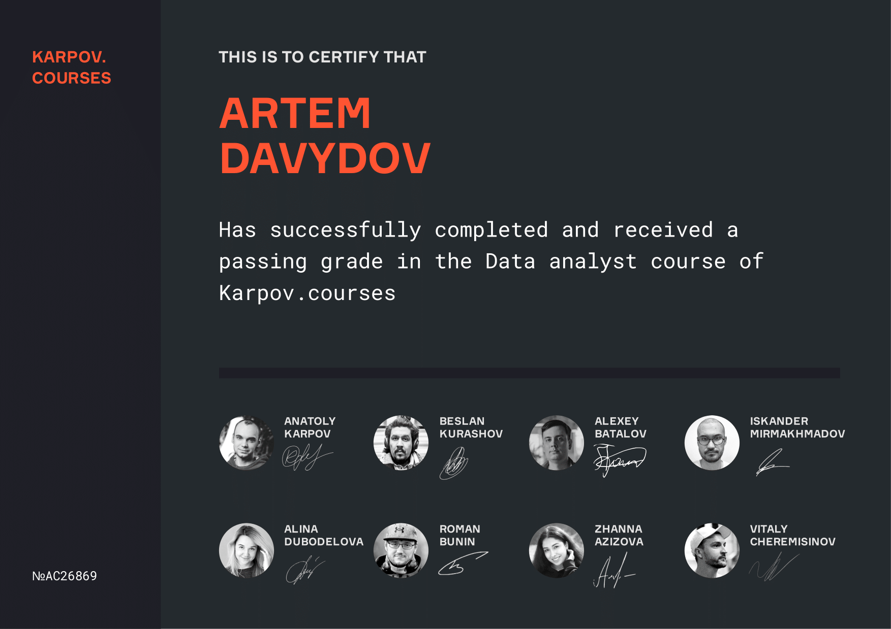
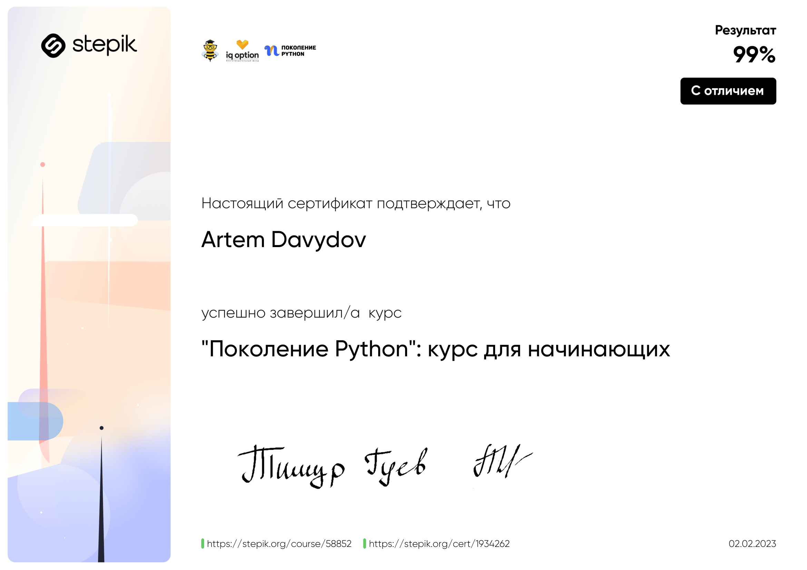
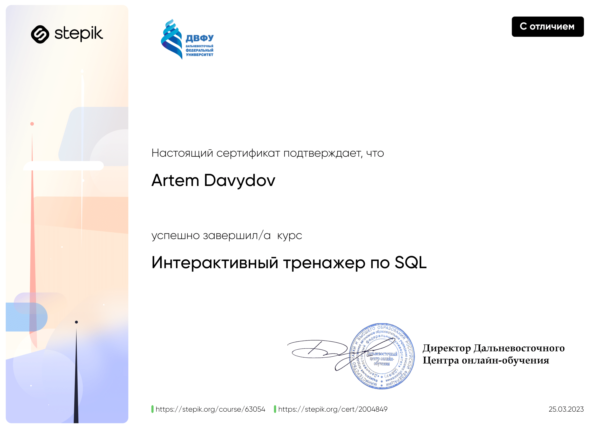
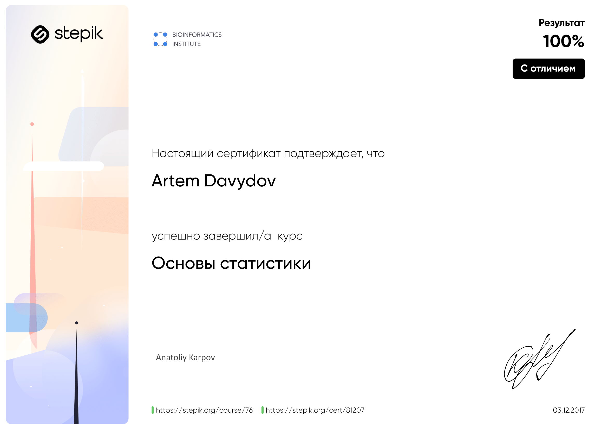
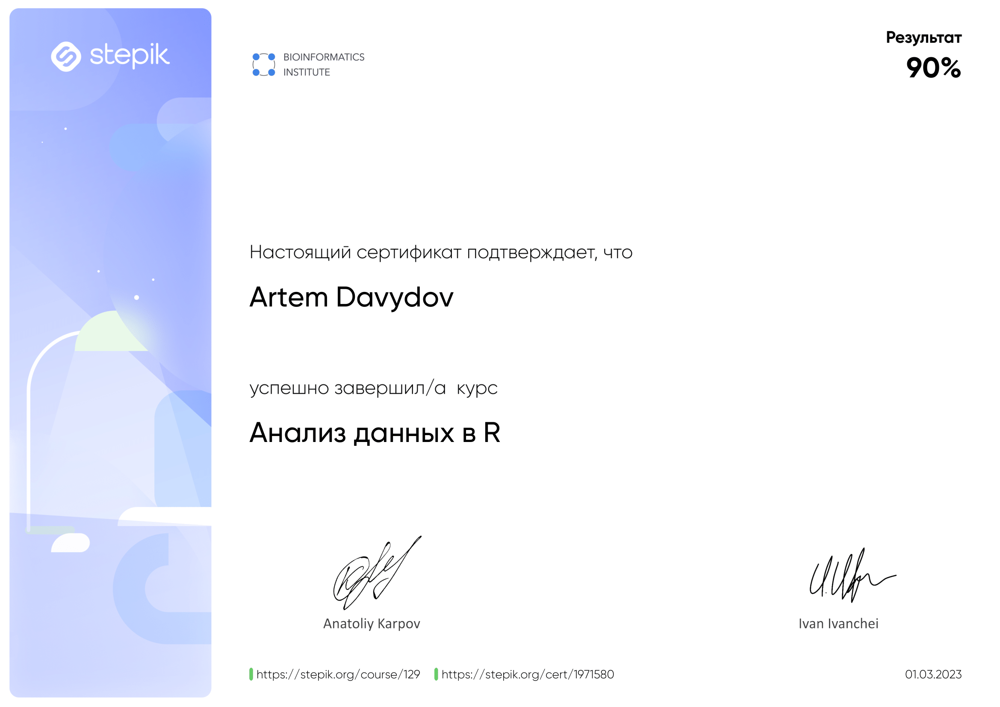
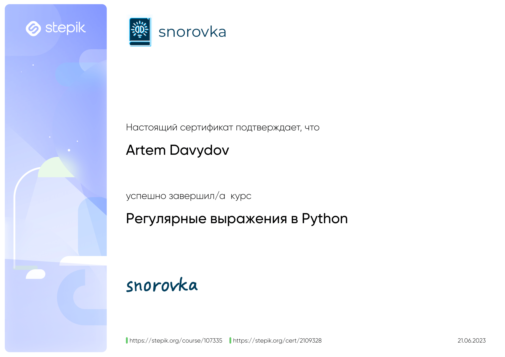

### Здравствуйте!/Hello! 👋

***
О себе/About me

Меня зовут Артем Давыдов, с ноября 2022 года я изучаю аналитику данных. Ранее я занимался анализом данных в рамках социологии и опросов населения.
Для углубления знаний в анализе прошел несколько онлайн курсов, с помощью которых освоил Python, SQL, математическую статистику, теорию вероятности, продуктовые метрики и фреймворки для развития продукта. На академических проектах практиковался в проведении статистических тестов, создании дашбордов в Tableau, использовании GIT и AIRFLOW.

My name is Artem Davydov, I have been studying data analytics since November 2022. Previously I was engaged in data analysis in sociology and population surveys. To deepen my knowledge in analysis I took some online courses, with the help of which I mastered Python, SQL, mathematical statistics, probability theory, product metrics and frameworks for product development. On academic projects practiced in conducting statistical tests, creating dashboards in Tableau, the use of GIT and AIRFLOW.

Контакты/Contacts:
[ссылка на тг](https://t.me/Artemiy_1995_2)

Сертификаты с пройденных курсов/certificates from completed courses:
)
-1.png))

<!--
**artemspb2/artemspb2** is a ✨ _special_ ✨ repository because its `README.md` (this file) appears on your GitHub profile.

Here are some ideas to get you started:

- 🔭 I’m currently working on ...
- 🌱 I’m currently learning ...
- 👯 I’m looking to collaborate on ...
- 🤔 I’m looking for help with ...
- 💬 Ask me about ...
- 📫 How to reach me: ...
- 😄 Pronouns: ...
- ⚡ Fun fact: ...
-->
